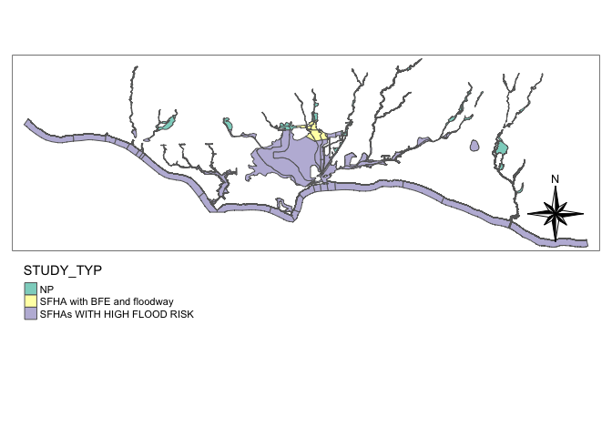

<!-- README.md is generated from README.Rmd. Please edit that file -->

# NFHL: National Flood Hazard Layers

<!-- badges: start -->

[](https://travis-ci.org/mikejohnson51/NFHL)
[](http://github.com/badges/stability-badges)

<!-- badges: end -->

The goal of NFHL is to provide access to the [National Flood Hazards
Layers](https://www.fema.gov/national-flood-hazard-layer-nfhl) using the
[AOI](https://github.com/mikejohnson51/AOI) subsetting workflows. Some
preliminary thoughts on makeing this data more ‘serviceable’ are also
given.

## Installation

You can install the development version of NFHL from
[GitHub](https://github.com/) with:

``` r
# install.packages("devtools")
remotes::install_github("mikejohnson51/NFHL")

# load libraries

library(NFHL)
library(AOI)
library(dplyr)
```

## Basic Workflow

### Layer IDs

The NFHL offers data for 32 layers whose type and ID can be found with
`nfhl_meta`:

``` r
nfhl_meta
```


### LayerID descriptions

Some of the layer names are vaugue. The `describe_nfhl` function scrapes
the metadata for a given layerID and provides the name, description and
spatial extents.

Lets learn more about layerID 14, ‘Cross-Sections’:

``` r
nfhl_describe(14)
#> $Layer
#> [1] "Cross-Sections (ID: 14)"
#> 
#> $Description
#> [1] "Normally, any FIRM that has associated flood profiles has cross sections. The S_XS table contains information about cross section lines. These lines usually represent the locations of channel surveys performed for input into the hydraulic model used to calculate flood elevations. Sometimes cross sections are interpolated between surveyed cross sections using high accuracy elevation data. Depending on the zone designation (Zone AE, Zone A, etc.), these locations may be shown on Flood Profiles in the FIS report and can be used to cross reference the Flood Profiles to the planimetric depiction of the flood hazards. This information is used in the Floodway Data Tables in the FIS report, as well as on the FIRM panels.  "
#> 
#> $bbox
#> Geometry set for 1 feature 
#> geometry type:  POLYGON
#> dimension:      XY
#> bbox:           xmin: -170.8102 ymin: -14.3509 xmax: 145.7601 ymax: 64.89804
#> epsg (SRID):    4269
#> proj4string:    +proj=longlat +ellps=GRS80 +towgs84=0,0,0,0,0,0,0 +no_defs
#> POLYGON ((-170.8102 -14.3509, 145.7601 -14.3509...
```

### Getting Spatial Data

The `nfhl_get` function extacts the spatial data from the NDHL layers
for a given spatial extent.

A general workflow using the AOI/NFHL packages is

1.  defining an AOI extent  
2.  identifying a NFHL layerID  
3.  extracting the data

<!-- end list -->

``` r
# Define an AOI around UCSB
AOI <- aoi_get(list("UCSB", 10, 10))

# Look at layerID 28 description
nfhl_describe(28)$Description
#> [1] "Labels for flood zones. "

# Extract Flood Hazard Polygons and filter
floodhazard <- nfhl_get(AOI, 28) %>% 
  filter(SFHA_TF == "T")
```



## Examples

### NHD and Cross-sections

Before we learned that the NFHL offered cross-sectional information (ID:
14). Lets get this data for our UCSB AOI, and overlay it with
hydrographic data from the National Hydrograhpy Datast (NHD) found with
the [HydroData](https://github.com/mikejohnson51/HydroData) package.

``` r
nhd <- HydroData::findNHD(AOI)[[2]]
#> Returned object contains: 102 nhd flowlines
# Note that any sf object can be passed to nfhl_get
cs  <- nfhl_get(nhd, 14)
```


## “Linked” NHD and General Structures Data

Lets look at one final example where we extract the “General Structures”
identified in the NFHL (ID: 24) within the UCSB AOI.

``` r
nfhl_describe(24)$Description
#> [1] "This table includes levees, floodwalls, or dikes that have been designed for flood control, including those portions that are closure structures, whether or not they have been demonstrated to meet the NFIP requirements in 44 CFR 65.10. This information is shown in the Levees table in the FIS report and on the FIRM panels. The S_Levee table contains information about levees shown on the FIRMs that are accredited and known to be protecting against the 1-percent-annual-chance flood, as well as levees that are provisionally accredited, de-accredited, and never accredited. The purpose of this table is to document the accreditation status of levees, as well as associated information necessary to be shown on the FIRM and for the population of FIS report text related to levee structures. The spatial entities representing levees are lines, drawn at the centerline of levees, floodwalls, and levee closure structures.  "
stru <- nfhl_get(AOI, 24)
```


For some, linking these general structures to the NHD might be useful.
Here we’ll find those that cross the NHD, and add the ‘crosses’
relationship.

``` r
xx = st_join(stru, 
        st_transform(nhd, st_crs(stru)),
        join = st_crosses,
        left = FALSE) %>% 
  st_drop_geometry() %>% 
  mutate(realtionship = "crosses") %>% 
  select(OBJECTID, realtionship, comid, STRUCT_TYP, LAYER)

dim(xx)
#> [1] 43  5
head(xx)
#> # A tibble: 6 x 5
#>   OBJECTID realtionship    comid STRUCT_TYP                                LAYER
#>      <int> <chr>           <int> <chr>                                     <dbl>
#> 1  2533589 crosses      17595405 Bridge                                       24
#> 2  2533592 crosses      17596107 Bridge                                       24
#> 3  2533594 crosses      17595351 1 PCT Annual Chance Flood Discharge Cont…    24
#> 4  2533597 crosses      17596119 Bridge                                       24
#> 5  2533905 crosses      17596113 Bridge                                       24
#> 6  2533911 crosses      17595357 Culvert                                      24
```

In total we find 43 structures that cross the NHD, realtion 1 in the
above tibble tells us that bridge 2533589 crosses COMID 17595405.

## Generalize to URIs

Each of these features (Structure and COMID) can be resolved to a URI
using the following patterns:

``` r
fema_base = 'https://hazards.fema.gov/gis/nfhl/rest/services/public/NFHL/MapServer/'
usgs_base = 'https://labs.waterdata.usgs.gov/api/nldi/linked-data/comid/'

linked = xx %>% 
  mutate(str_uri = sprintf("%s%s/query?&objectIds=%s&outFields=*&f=geoJSON", fema_base, LAYER,OBJECTID),
         realtionship,
         comid_uri = paste0(usgs_base, comid)) %>% 
  select(str_uri, realtionship, comid_uri)

head(linked)
#> # A tibble: 6 x 3
#>   str_uri                            realtionship comid_uri                     
#>   <chr>                              <chr>        <chr>                         
#> 1 https://hazards.fema.gov/gis/nfhl… crosses      https://labs.waterdata.usgs.g…
#> 2 https://hazards.fema.gov/gis/nfhl… crosses      https://labs.waterdata.usgs.g…
#> 3 https://hazards.fema.gov/gis/nfhl… crosses      https://labs.waterdata.usgs.g…
#> 4 https://hazards.fema.gov/gis/nfhl… crosses      https://labs.waterdata.usgs.g…
#> 5 https://hazards.fema.gov/gis/nfhl… crosses      https://labs.waterdata.usgs.g…
#> 6 https://hazards.fema.gov/gis/nfhl… crosses      https://labs.waterdata.usgs.g…
```

## Working with URIs

The basic URI stings can then be directly called to operate on and use
the represented features\!

### Basic Mapping

``` r
tm_shape(bg2) + tm_rgb() +
  tm_shape(read_sf(linked$str_uri[1])) +
  tm_lines(col = "red", lwd = 5) +
 tm_shape(read_sf(linked$comid_uri[1])) +
  tm_lines(col = 'blue', lwd = 2) +
  tm_layout(title = read_sf(linked$str_uri[1])$STRUCT_TYP)
```


### Elevation at Intersection

We can use our resource URIs to call the respective spatial feautures,
intersect, them, extract the coordinates or intersection, and use those
to query the USGS elevation API:

``` r
system.time({
  ## Coordinates of Intersection
  coords <- st_coordinates(st_intersection(read_sf(linked$comid_uri[1]), 
                           read_sf(linked$str_uri[1])))
  
  # Query USGS elevation API
  url <- sprintf('http://ned.usgs.gov/epqs/pqs.php?x=%s&y=%s&units=Meters&output=json', coords[1], coords[2]) 
          
  elev = read_json(url) 
})
#>    user  system elapsed 
#>   0.107   0.010   1.566
```

``` r
(elev)
#> $USGS_Elevation_Point_Query_Service
#> $USGS_Elevation_Point_Query_Service$Elevation_Query
#> $USGS_Elevation_Point_Query_Service$Elevation_Query$x
#> [1] -119.8136
#> 
#> $USGS_Elevation_Point_Query_Service$Elevation_Query$y
#> [1] 34.45297
#> 
#> $USGS_Elevation_Point_Query_Service$Elevation_Query$Data_Source
#> [1] "3DEP 1/3 arc-second"
#> 
#> $USGS_Elevation_Point_Query_Service$Elevation_Query$Elevation
#> [1] 22.75
#> 
#> $USGS_Elevation_Point_Query_Service$Elevation_Query$Units
#> [1] "Meters"
```

## Acknowdegements

[Mike Johnson](http://mikejohnson51.github.io) is a graducate student in
geography working with [Keith
Clarke](http://www.geog.ucsb.edu/~kclarke/). This work contributes to
the NSF funded [Convergence Accelorator
Program](https://nsf.gov/awardsearch/showAward?AWD_ID=1937099&HistoricalAwards=false)
on [Urban Flooding](https://ufokn.github.io/UFOKN/).

This package is experimental and comes with no garuntee 😄. Pull requests
are welcome\!\!
